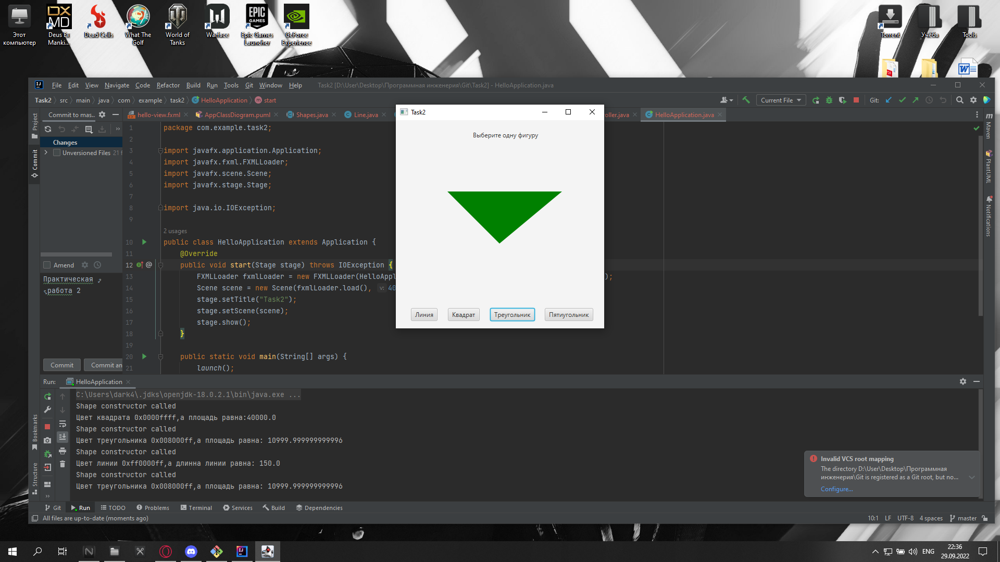
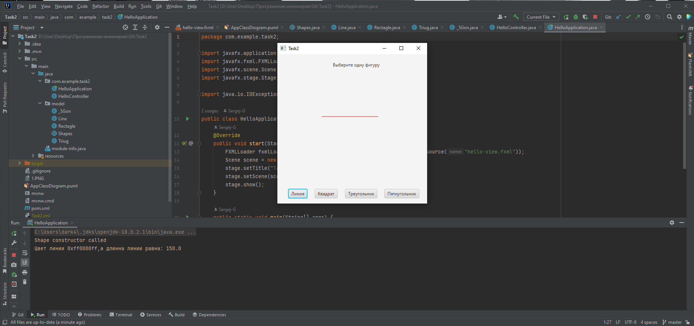
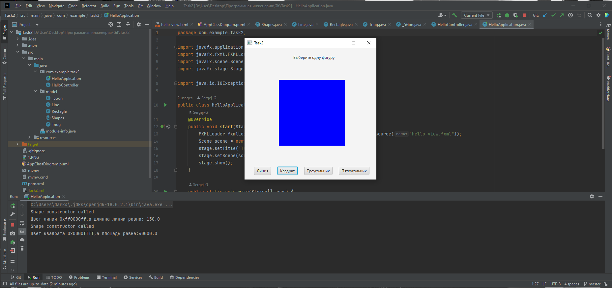
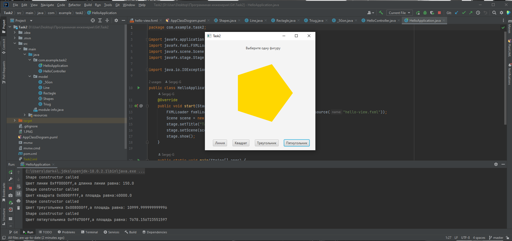

# ПРАКТИЧЕСКАЯ РАБОТА №2
Вывод треугольника

Вывод линии

Вывод квадрата

Вывод пятиугольника

## В ходе практической работы были реализованны следующие пункты:
- Абстрактный супер класс Shapes
- - Абстрактный метод Draw, класса Shapes
- - Абстрактный метод Area, класса Shapes
- Класс Line, наследующий класс Shapes и отвечающий за логику отрисовки линии и вычисления её длинны
- Класс Rectagle, наследующий класс Shapes и отвечающий за логику отрисовки квадрата и вычисления его площади
- Класс Triug, наследующий класс Shapes и отвечающий за логику отрисовки треугольника и вычисления его площади
- Класс _5Gon, наследующий класс Shapes и отвечающий за логику отрисовки пятиугольника и вычисления его площади
- Конструкторы классов
